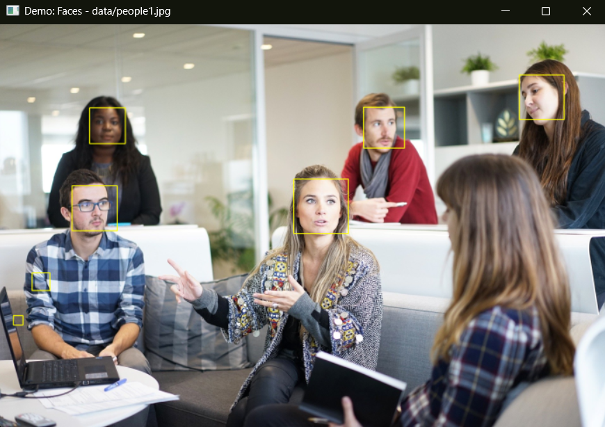
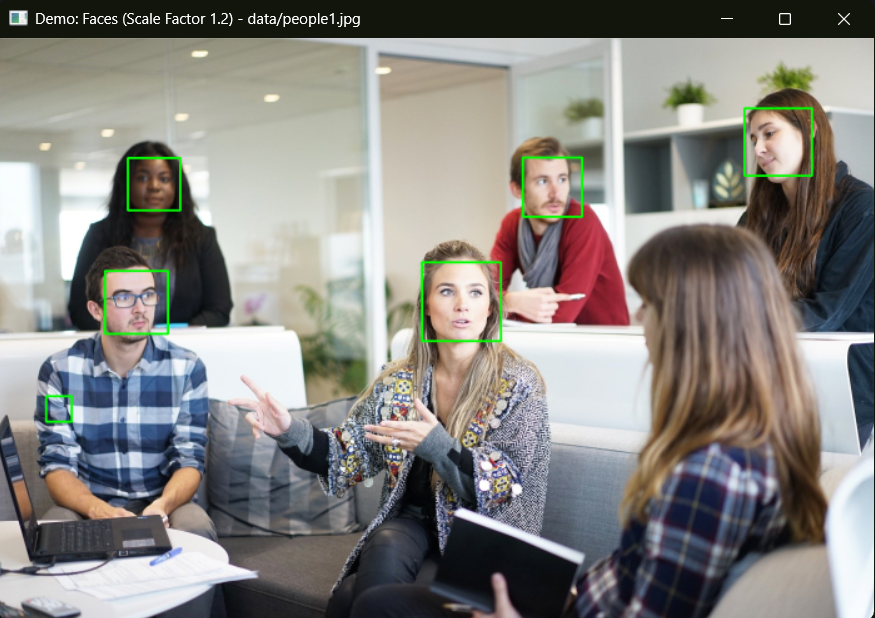
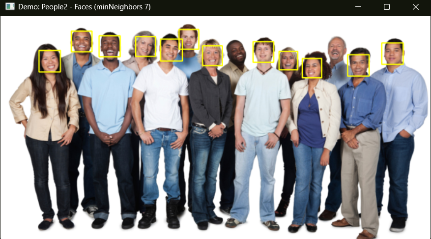
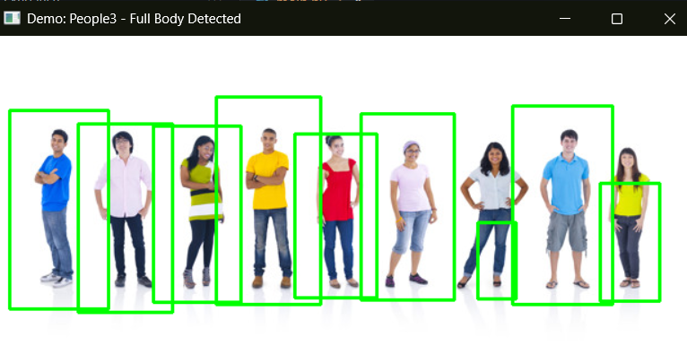

# **Human Object Detection using OpenCV Haar Cascades**

## **Project Overview**

This project provides a **foundational demonstration** of object detection using **OpenCV's Haar Cascade classifiers**. It's designed to identify human faces, eyes, and full bodies within static images. The application offers an **interactive experience**, allowing users to explore both predefined demo images and test their own custom inputs.

## **Key Features**

* **Accurate Detection:**
  * **Faces:** Detects frontal and near-frontal human faces.
  * **Eyes:** Locates eyes within detected face regions.
  * **Full Bodies:** Identifies full human figures.
* **Parameter Exploration:** Demonstrates the impact of crucial Haar Cascade parameters like `scaleFactor`, `minNeighbors`, `minSize`, and `maxSize` on detection performance.
* **Interactive User Interface:** Provides a **command-line interface** for users to input their own image paths, making the tool versatile.
* **Clear Visual Output:** Displays detected objects with **distinctive bounding boxes** on the original images.
* **Intelligent Feedback:** Offers helpful console messages, including guidance when no objects are detected, explaining potential reasons related to Haar Cascade limitations.
* **Consistent Display:** All output windows are **automatically resized** to a consistent maximum dimension while preserving the original image's aspect ratio, ensuring proper viewing on various screen sizes (e.g., 15-17 inch laptops).
* **Visually Appealing Bounding Boxes:** Uses a **consistent and appealing color scheme** for different object types (Faces, Eyes, Full Bodies, and User-provided image detections).

## **Technologies Used**

* **Python 3.x:** The primary programming language.
* **OpenCV (`cv2`):** Essential for image processing and the implementation of Haar Cascade classifiers.
* **NumPy:** Utilized by OpenCV for efficient array operations.
* **Argparse:** For robust command-line argument parsing.

## **Setup & Installation**

To get this project running on your local machine, follow these **simple steps**:

1. **Clone the repository:**
    ```bash
    git clone https://github.com/Ailesh69/human-object-detection.git
    cd human-object-detection
    ```

2. **Create and activate a virtual environment:**
    ```bash
    python -m venv venv
    # On Windows:
    .\venv\Scripts\activate
    # On macOS/Linux:
    source venv/bin/activate
    ```

3. **Install dependencies:**
    ```bash
    pip install -r requirements.txt
    ```

4. **Verify data files:**
    Ensure the `data/` folder contains required `.xml` cascade files (`frontface.xml`, `eyes.xml`, `fullbody.xml`) and sample images (`people1.jpg`, etc.).

## **How to Run the Application**

1. **Run the script:**
    ```bash
    python main.py
    ```

2. **To use a custom image:**
    ```bash
    python main.py --image data/my_custom_image.jpg
    ```

3. **Interactive mode options:**
    ```
    --- Demo Predictions Complete ---

    What would you like to do next?
    1) Enter your own image for detection
    2) Exit the code
    Enter your choice (1 or 2):
    ```

    * Type `1` to input a new image path (e.g., `data/image.jpg`)
    * Type `2` to exit

**Tip:** Do **not** include quotes around image paths.

## **Demo / Screenshots**

* **Initial Face Detection:**
  

* **Face Detection with Scale Factor 1.2:**
  

* **Multiple Face Detection with minNeighbors:**
  

* **Combined Face (Green) and Eye (Blue) Detection:**
  

* **Full Body Detection:**
  

## **Understanding Haar Cascades: Limitations & Value**

Haar Cascades identify light/dark pattern features characteristic of objects and work well on CPUs. However:

* **Highly sensitive** to lighting, pose, and occlusion
* May cause **false positives/negatives**
* Use a **fixed feature set**, unlike adaptable deep learning models

Despite limitations, this project demonstrates:
* Classical computer vision implementation
* Importance of preprocessing and tuning
* A stepping stone to more advanced detection techniques

## **Future Enhancements**

* Add **Dlib's HOG + SVM** detector
* Use **MTCNN, YOLO, or SSD** for deep learning-based detection
* Support **real-time webcam detection**
* Build a **GUI** with Tkinter, PyQt, or Streamlit

## **License**

This project is open-source under the [MIT License](LICENSE).

## **Contact**

**Author:** Ailesh  
**GitHub:** [https://github.com/Ailesh69](https://github.com/Ailesh69)
